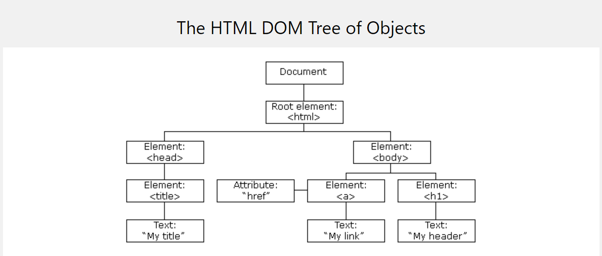
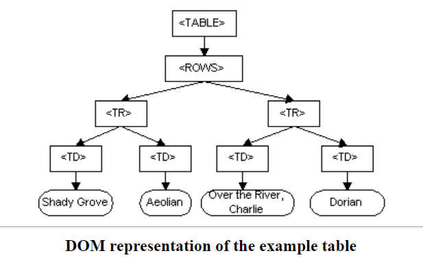
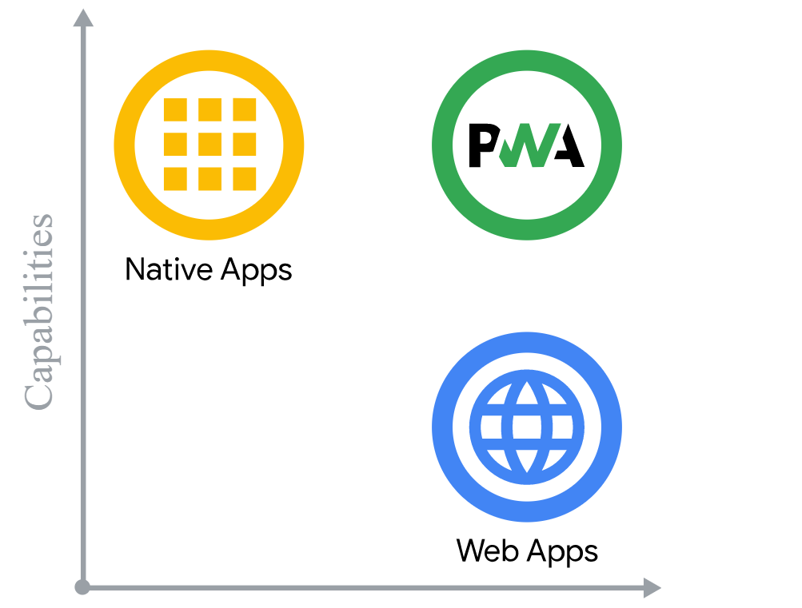
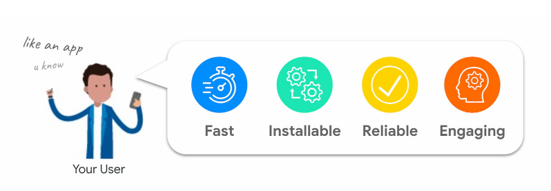
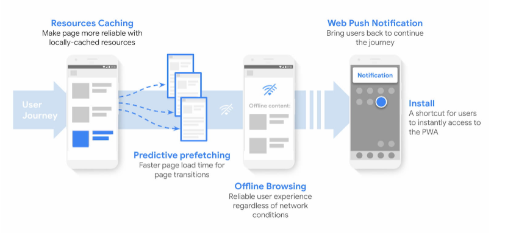

##### home_work-2
# The HTML DOM (Document Object Model)
The **HTML DOM** model is constructed as a tree of **Objects:**

## Introduction
The Document Object Model (DOM) is a programming API for HTML and XML documents. It defines the logical structure of documents and the way a document is accessed and manipulated. In the DOM specification, the term "document" is used in the broad sense - increasingly, XML is being used as a way of representing many different kinds of information that may be stored in diverse systems, and much of this would traditionally be seen as data rather than as documents. Nevertheless, XML presents this data as documents, and the DOM may be used to manage this data.

With the Document Object Model, programmers can create and build documents, navigate their structure, and add, modify, or delete elements and content. Anything found in an HTML or XML document can be accessed, changed, deleted, or added using the Document Object Model, with a few exceptions - in particular, the DOM interfaces for the internal subset and external subset have not yet been specified.

As a W3C specification, one important objective for the Document Object Model is to provide a standard programming interface that can be used in a wide variety of environments and applications. The Document Object Model can be used with any programming language. In order to provide precise, language-independent specification of the Document Object Model interfaces, we have chosen to define the specifications in OMG IDL, as defined in the CORBA 2.2 specification. In addition to the OMG IDL specification, we provide language bindings for Java and ECMAScript (an industry-standard scripting language based on JavaScript and JScript). Note: OMG IDL is used only as a language-independent and implementation-neutral way to specify interfaces. Various other IDLs could have been used; the use of OMG IDL does not imply a requirement to use a specific object binding runtime.
## What the Document Object Model is?
The Document Object Model (DOM) is a programming interface for HTML and XML documents. It represents the page so that programs can change the document structure, style, and content. The DOM represents the document as nodes and objects. That way, programming languages can connect to the page.

A Web page is a document. This document can be either displayed in the browser window or as the HTML source. But it is the same document in both cases. The Document Object Model (DOM) represents that same document so it can be manipulated. The DOM is an object-oriented representation of the web page, which can be modified with a scripting language such as JavaScript.

The W3C DOM and WHATWG DOM standards are implemented in most modern browsers. Many browsers extend the standard, so care must be exercised when using them on the web where documents may be accessed by various browsers with different DOMs.
The Document Object Model is a programming API for documents. The object model itself closely resembles the structure of the documents it models. For instance, consider this table, taken from an HTML document:

      <TABLE>
      <ROWS> 
      <TR> 
      <TD>Shady Grove</TD>
      <TD>Aeolian</TD> 
      </TR> 
      <TR>
      <TD>Over the River, Charlie</TD>
      <TD>Dorian</TD> 
      </TR> 
      </ROWS>
      </TABLE>
    
The Document Object Model represents this table like this:

The name "Document Object Model" was chosen because it is an "object model" is used in the traditional object oriented design sense: documents are modeled using objects, and the model encompasses not only the structure of a document, but also the behavior of a document and the objects of which it is composed. In other words, the nodes in the above diagram do not represent a data structure, they represent objects, which have functions and identity. As an object model, the Document Object Model identifies:

- the interfaces and objects used to represent and manipulate a document
- the semantics of these interfaces and objects - including both behavior and attributes
- the relationships and collaborations among these interfaces and objects
## DOM and JavaScript
The short example above, like nearly all of the examples in this reference, is JavaScript. That is to say, it's written in JavaScript, but it uses the DOM to access the document and its elements. The DOM is not a programming language, but without it, the JavaScript language wouldn't have any model or notion of web pages, HTML documents, XML documents, and their component parts (e.g. elements). Every element in a document—the document as a whole, the head, tables within the document, table headers, text within the table cells—is part of the document object model for that document, so they can all be accessed and manipulated using the DOM and a scripting language like JavaScript.

In the beginning, JavaScript and the DOM were tightly intertwined, but eventually, they evolved into separate entities. The page content is stored in the DOM and may be accessed and manipulated via JavaScript, so that we may write this approximative equation:

API = DOM + JavaScript

# PWA - Progressive Web Application
A progressive web application (PWA) is a type of application software delivered through the web, built using common web technologies including HTML, CSS and JavaScript. It is intended to work on any platform that uses a standards-compliant browser, including both desktop and mobile devices.

While web applications have been available for mobile devices from the start, they have generally been slower, have had fewer features, and have been less used than native apps. PWA features allow to close the gap to native applications and create similar user experiences. Features include

- Work Offline
- Hight Performance
- Background processing in service workers in a separate thread
- Access to the phone's sensors
- Support for push notifications
- An icon on the phone‘s home screen

The web is an incredible platform. Its mix of ubiquity across devices and operating systems, its user-centered security model, and the fact that neither its specification nor its implementation is controlled by a single company makes the web a unique platform to develop software on. Combined with its inherent linkability, it's possible to search it and share what you've found with anyone, anywhere. Whenever you go to a website, it's up-to-date, and your experience with that site can be as ephemeral or as permanent as you'd like. Web applications can reach anyone, anywhere, on any device with a single codebase.

Platform-specific applications, are known for being incredibly rich and reliable. They're ever-present, on home screens, docks, and taskbars. They work regardless of network connection. They launch in their own standalone experience. They can read and write files from the local file system, access hardware connected via USB, serial or bluetooth, and even interact with data stored on your device, like contacts and calendar events. In these applications, you can do things like take pictures, see playing songs listed on the home screen, or control song playback while in another app. Platform-specific applications feel like part of the device they run on.

## How Progressive Web Apps can drive business success:
Progressive Web Apps are on a lot of companies' roadmap to modernize their website and adapt to users' new expectations. Like all new concepts and technical capabilities, they raise questions: is it what my customers want, how much will it grow my business, what is technically feasible?

## PWAs solve customer needs
One rule we love to follow at Google when making products is "focus on the user and all else will follow". Think user-first: what are my customers' needs, and how does a PWA provide them?

When doing user research, we find some interesting patterns:

- Users hate delays and unreliability on mobile: the level of stress caused by mobile delays is comparable to watching a horror movie.
- Fifty percent of smartphone users are more likely to use a company's mobile site when browsing or shopping because they don't want to download an app.
- One of the top reasons for uninstalling an app is the limited storage (whereas an installed PWA usually takes less than 1MB).
- Smartphone users are more likely to purchase from mobile sites that offer relevant recommendations on products, and 85% of smartphone users say mobile notifications are useful.

## PWAs leverage modern web capabilities

PWAs provide a set of best practices and modern web APIs that are aimed at meeting your customers' needs by making your site fast, installable, reliable, and engaging.

For example, using a service worker to cache your resources and doing predictive prefetching makes your site faster, and more reliable. Making your site Installable provides an easy way for your customers to access it directly from their home screen or app launcher. And new APIs like Web Push Notifications make it easier to re-engage your users with personalized content to generate loyalty.

