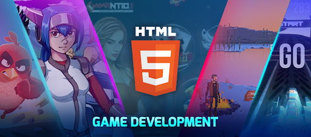
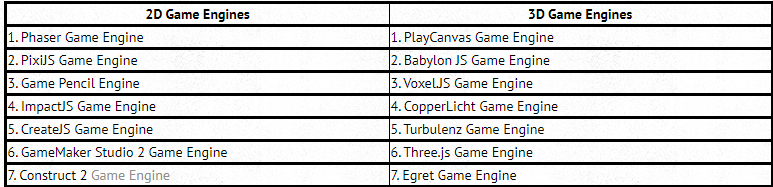
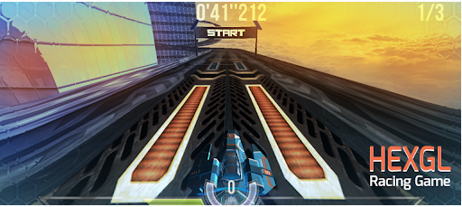
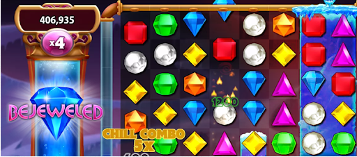

RESEARCH - JavaScript Academy

# HTML5 Game Engines & HTML5 Game Developmen

## WHAT IS HTML5 GAME DEVELOPMENT

HTML5 is now widely used for game development as it allows to create  video games that can be easily played through web browsers of smartphones and desktops. HTML5 games are cross-platform and cross-browser enabled, hence developers get the freedom to write one code and conquer all, with just a bit  of personalization in the code for each platform. So, using HTML5, developers can build games much faster than native game apps. 

Developers initially used Adobe Flash Player to build online games but after the release of HTML5 in 2014 there was no looking back to Flash. Developers quickly moved from Flash to HTML5 conversion services for its cutting-edge functionalities, major browsers stopping support for Flash and Flash plugins becoming too heavy to get the desired results.

 Rise of smartphones is also a big reason why Flash became redundant (most smartphones don’t support Flash and simply cannot display web games). Today’s gamers look for games that are accessible and connected, and what could be better in that regard than a web browser? However, if you want you can also port HTML5 games as native mobile game apps (ioS, Android) by using technologies like Apache Cordova (formerly Phonegap) and CocoonJS. Other technologies like Javascript and CSS enhance HTML5 to create interactive and engaging game content. Let’s get to know more about the tech stack often.

 ## TECH STACK OF HTML5 GAME DEVELOPMENT

 Canvas and Web Graphics Library (WebGL) are the core technologies used in HTML5 game development. Developers heavily rely on these two technologies to create advanced games for web browsers. Using Canvas element, developers do scriptable rendering of 2D shapes and bitmap images, whereas WebGL (a JavaScript API) is used to draw and convert any shapes into 2D/3D images and render them within web browsers. The beauty of WebGL is that it paves the way to create high quality, hardware accelerated 3D graphics without having to use plug-ins. Now, have a look at popular HTML5 game engines.

 ## HTML5 GAME ENGINES

 

 If you also want to build for platforms other than the web, the game engines below are among the best for cross-platform HTML5 games.

 ## CROSS-PLATFORM ENGINES
 

 ## List of popular HTML5 Games

 ### HEXGL RACING GAME

 

 HexGL is a futuristic, fast-paced racing game inspired from Wipeout and F-Zero. HexGL was created by Thibaut Despoulain, a software engineer at Artillery Games and WebGL aficionado, using HTML5, Javascript, WebGL and  three.js. 
 
 The game requires you to glide and control a spaceship to avoid walls on tight turns by using your keyboard or touchscreen device or even a leap motion controller. 
 
 HexGL is an online web browser game that truly shows the power of HTML5 to build high-graphics games. Depending on the hardware capabilities of your device, you can choose from three different graphics quality settings. 
 
 You can play HexGL for free to become the greatest space racer and win the hearts of millions of racing game fans around the world. HexGL is a great example that shows what is graphically possible with HTML5.

 ### BEJEWELED PUZZLE GAME

 

 Bejeweled is a classic puzzle game that uses  WebGL for accelerated 2D graphics. The HTML5 version of the game has a smooth gameplay and subtle effects, making it stand out. Players enjoy playing this game for hours where they keep matching three gems to make them burst.
 
  Players get bonus points when they form chains of more than three identical gems and also when they form two chains in one swap.    Bejeweled shows how classic games can be built using HTML5 with enhanced graphics and gameplay.
  
   The creator PopCap Games tried hands at HTML5 to offer the title across a wide range of devices and platforms. The leading global developer, publisher and operator of casual video games said that the potential of HTML5 gaming is very interesting and holds a great promise for cross-platform development across all browsers and mobile devices.

