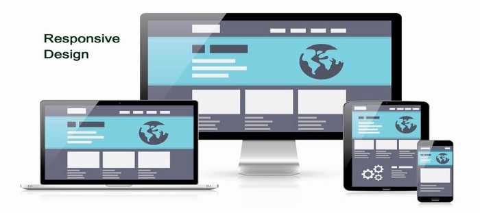
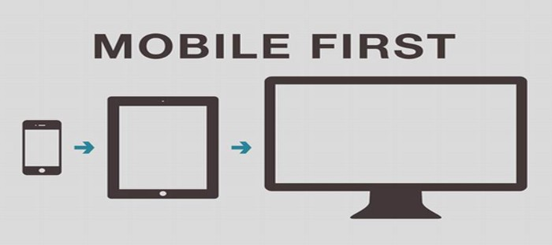

RESEARCH - JavaScript Academy
# Mobile - First Design
## What is Mobile First Design? Why It’s Important & How To Make It?

On the Mobile World Congress in 2010, Eric Schmidt, the CEO of Google put forward that designers should follow the “mobile first” rule in product design. What does “mobile first design” mean? Why is it important? How to make it? I’ll answer these 3 questions in the following part.

## What is Mobile First Design?
Mobile first design is a design strategy that says when you create a website or app, you should start sketching and prototyping the smallest screen first and work your way up to larger screens. Essentially, it’s about delivering the right user experience to the right device.

The reason that this makes sense is because with such limited real estate on small screens, UX designers must prioritize the most important aspects of their website and apps, namely content.

For many years, mobile websites were an afterthought to the design process. An addition not a necessity. The slow decline of desktop coupled with the rise of mobile phones over the last 5 years has shown that mobile first design has to take priority.
To understand the concept of mobile-first design better, you should know the two phrases below first.

### 1.  Responsive Web Design (RWD)
Responsive web design is a web design method that enables web to fit the screens of different devices automatically, displaying the content in a way that people feel comfortable. This greatly reduces users’ operations like panning, zooming and scrolling when browsing the web.

### 2. “Progressive Advancement” & “Graceful Degradation”
These two concepts were put forward before responsive web design. In order to make web or application interface display reasonably on different devices, designers provide customized versions of product for different ends.

Progressive Advancement means that when we design a product, first we build a version for the relatively lower browser (like that on a mobile phone). This version includes the most basic functions & features. After that, we tend to the advanced version for a tablet or PC, which is created by adding interactions, more complicated effects, etc. on the basic version for a better user experience.
“Graceful Degradation”, on the contrary, starts the product design from an advanced end like desktop and builds a version with well-rounded features at the beginning. Then designers make the product compatible with mobile ends by cutting some functions or contents.

Progressive Advancement has won the game for now as far as I can see. If UI/UX designers start a product design with its desktop version, they will inevitably want to make use of most of the advantages of the advanced end. For example, the hover effect which is supported by a cursor mouse; HD images & complex charts which can display normally only when there is a recent bandwidth. In this way, the designers will make efforts to complete an amazing desktop version and only to find it can hardly be adopted on a mobile end unless they give up a lot of beautiful ideas. If so, the mobile end version will be more like an afterthought, an incomplete product which’s been watered down.

But if we take the mobile end product design as a starting point, under the restrictions like bandwidth, screen size and so on, designers will naturally seize the key points of a product, head for a lean & neat product with prioritized features. When the platform is expanded to a tablet or PC, designers are able to take advantages of the unique features of these advanced ends to strengthen the product step by step. This might be the main reason that progressive advancement strategy is widely used.
You may ask, why do you spend so much time on explaining the two concepts? The answer is that “mobile first” is exactly a rule of “progressive advancement”.

“Mobile first”, as the name suggests, means that we start the product design from the mobile end which has more restrictions, then expand its features to create a tablet or desktop version.

## Benefits of mobile first design
Mobile conversions rates are up 64% when compared with the average desktop conversion rates. So designing mobile first can lead to more profit for your business. And since Google ranks for mobile-friendliness, it makes sense to bear this in mind when starting a new project.

This way of designing is also beneficial when it comes to download times and users accessing your content as quickly as possible. With fewer elements, the page will load faster. When you consider a 1 second delay causing a 7% loss in conversions – it pays to design mobile first.

When you design from the smallest screen to the largest screen, this is known as progressive enhancement. It’s about designing with a strong foundation and adding enhancements as you go.

With mobile first, you create your strong foundation. This foundation will help strengthen other designs for tablet and desktop. The foundation should always be content and mobile first design emphasizes content over navigation – users get the information they need quicker.

This will also make your life easier since mobile first design starts off with the tackling the hardest screen size to design for. The rest inevitably falls into place.

Mobile first design forces you to really focus and maintain clarity by removing any unnecessary user interface decoration. By removing any distractions, you’ll invariably improve the user experience and that makes good business sense.

Mobile first is content first
Content takes center stage in mobile first design. With mobile first design, you have to give your users the content that they absolutely need. Designing this way, with such stringent limitations, forces UX designers to strip any extraneous elements away and focus on the essential.

When we talk of extraneous elements we don’t mean that they’re not necessary – they’re just not necessary for your mobile users. You can still use any UI elements you remove from your mobile first design in a desktop version, for example.

This is because content is context dependent. A mobile user will have different needs than a desktop user. A desktop user may be looking for more in-depth information or additional features that wouldn’t make sense when it comes to mobile first design.

On a traditional desktop website, you are more likely to see white space whereas collapsible menus and widgets are more prominent in mobile sites. The same can be said of photos – expect full size imagery on a desktop. We’re talking advertisements and promotional material. This sort of imagery will be reduced (or even removed) on mobile websites.

Breakpoints are also important to mention. Normally you would define your breakpoints depending on the device.

For example, when you resize your browser from large to small, you will see the presentation of the content change at specific breakpoints – these breakpoints are used to change the content to fit the device. On our blog, for example, when you resize below 1223 pixels wide, the content will change to suit the newer size.

This approach becomes untenable when you consider the vast number of mobile devices on the market. Because of this, it’s best to create content specific breakpoint. What does that mean? It means creating a breakpoint for when the content is no longer easy to consume. The best sort of design is one which solves future problems prematurely.