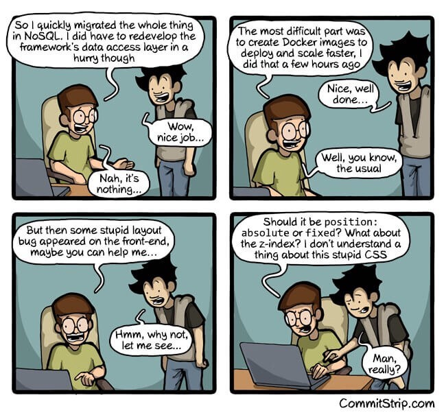

RESEARCH - JavaScript Academy

# Naming convention (HTML & CSS)

## CSS Naming Conventions that Will Save You Hours of Debugging

I have heard lots of developers say they hate CSS. In my experience, this comes as a result of not taking the time to learn CSS.

Korean ??

알림: 한국인 독자분들을 위해 본 기사는 한국어로 번역되었으며, 한국어 버전은 여기에서 보실 수 있습니다

CSS isn’t the prettiest ‘language,’ but it has successfully powered the styling of the web for over 20 years now. Not doing too badly, huh?

However, as you write more CSS, you quickly see one big downside.

It is darn difficult to maintain CSS.

Poorly written CSS will quickly turn into a nightmare.

Here are a few naming conventions that will save you a bit of stress and countless hours down the line.

