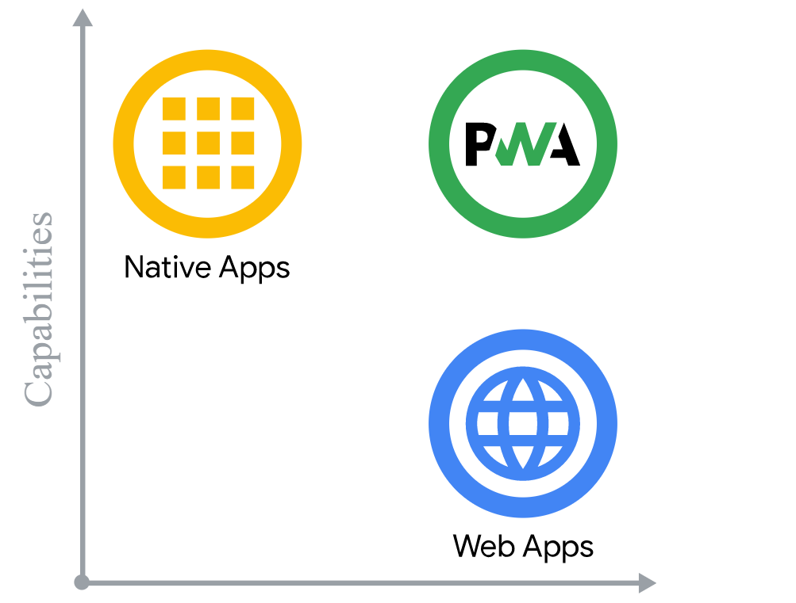
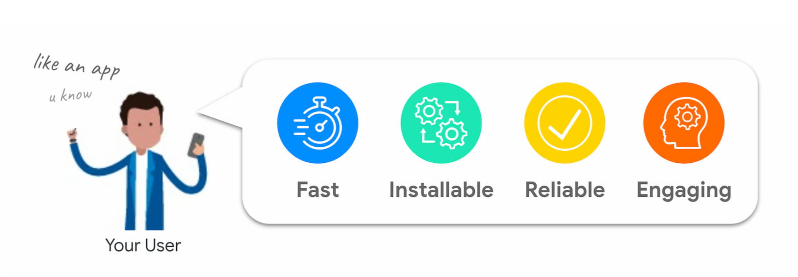
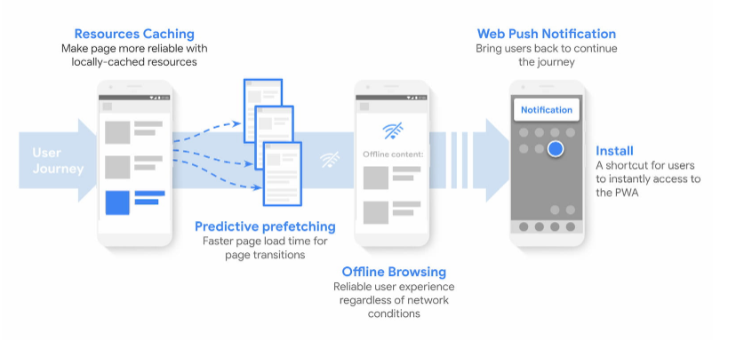

RESEARCH - JavaScript Academy
# PWA - Progressive Web Application
A progressive web application (PWA) is a type of application software delivered through the web, built using common web technologies including HTML, CSS and JavaScript. It is intended to work on any platform that uses a standards-compliant browser, including both desktop and mobile devices.

While web applications have been available for mobile devices from the start, they have generally been slower, have had fewer features, and have been less used than native apps. PWA features allow to close the gap to native applications and create similar user experiences. Features include

- Work Offline
- Hight Performance
- Background processing in service workers in a separate thread
- Access to the phone's sensors
- Support for push notifications
- An icon on the phone‘s home screen

The web is an incredible platform. Its mix of ubiquity across devices and operating systems, its user-centered security model, and the fact that neither its specification nor its implementation is controlled by a single company makes the web a unique platform to develop software on. Combined with its inherent linkability, it's possible to search it and share what you've found with anyone, anywhere. Whenever you go to a website, it's up-to-date, and your experience with that site can be as ephemeral or as permanent as you'd like. Web applications can reach anyone, anywhere, on any device with a single codebase.

Platform-specific applications, are known for being incredibly rich and reliable. They're ever-present, on home screens, docks, and taskbars. They work regardless of network connection. They launch in their own standalone experience. They can read and write files from the local file system, access hardware connected via USB, serial or bluetooth, and even interact with data stored on your device, like contacts and calendar events. In these applications, you can do things like take pictures, see playing songs listed on the home screen, or control song playback while in another app. Platform-specific applications feel like part of the device they run on.

## How Progressive Web Apps can drive business success:
Progressive Web Apps are on a lot of companies' roadmap to modernize their website and adapt to users' new expectations. Like all new concepts and technical capabilities, they raise questions: is it what my customers want, how much will it grow my business, what is technically feasible?

## PWAs solve customer needs
One rule we love to follow at Google when making products is "focus on the user and all else will follow". Think user-first: what are my customers' needs, and how does a PWA provide them?

When doing user research, we find some interesting patterns:

- Users hate delays and unreliability on mobile: the level of stress caused by mobile delays is comparable to watching a horror movie.
- Fifty percent of smartphone users are more likely to use a company's mobile site when browsing or shopping because they don't want to download an app.
- One of the top reasons for uninstalling an app is the limited storage (whereas an installed PWA usually takes less than 1MB).
- Smartphone users are more likely to purchase from mobile sites that offer relevant recommendations on products, and 85% of smartphone users say mobile notifications are useful.

## PWAs leverage modern web capabilities

PWAs provide a set of best practices and modern web APIs that are aimed at meeting your customers' needs by making your site fast, installable, reliable, and engaging.

For example, using a service worker to cache your resources and doing predictive prefetching makes your site faster, and more reliable. Making your site Installable provides an easy way for your customers to access it directly from their home screen or app launcher. And new APIs like Web Push Notifications make it easier to re-engage your users with personalized content to generate loyalty.

