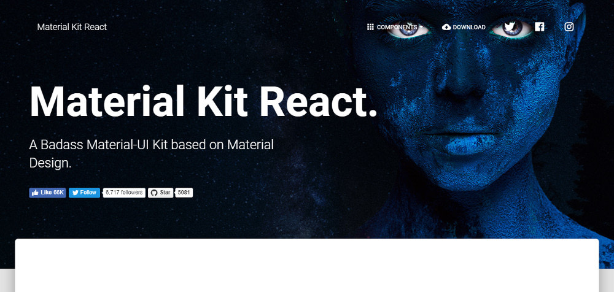
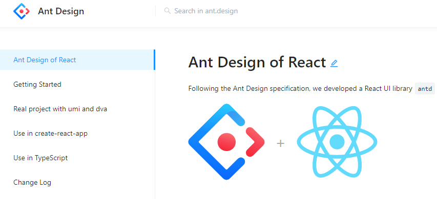
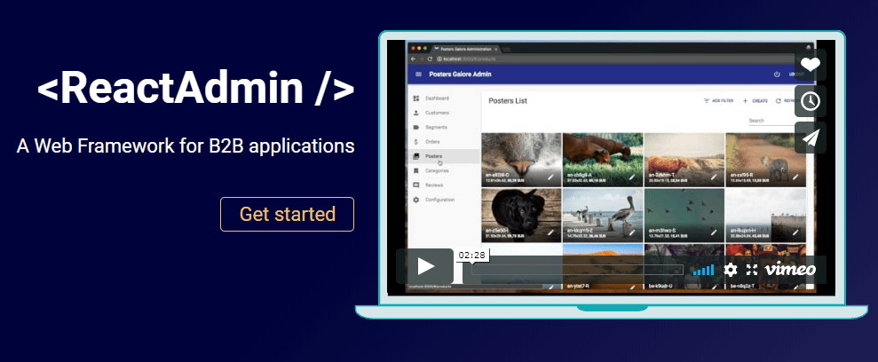
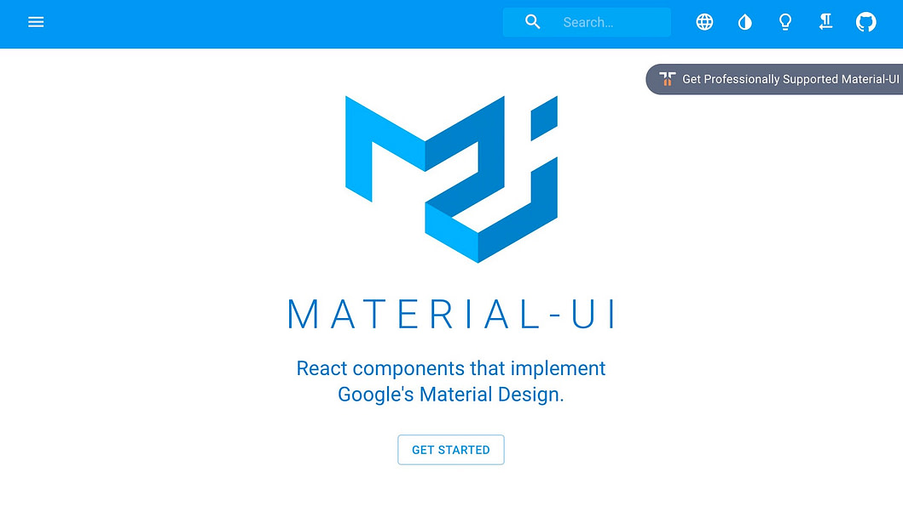
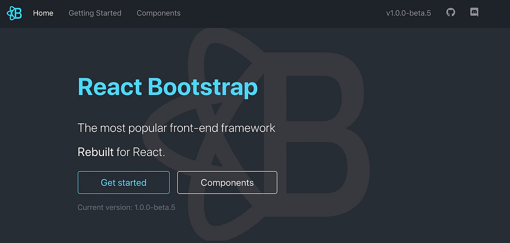

RESEARCH - JavaScript Academy

# UI libraries for React

## What is React?

CodeinWP content is free. When you purchase through referral links on our site, we earn a commission. Learn more
20+ Best React UI Component Libraries / Frameworks for 2020
byPriya Priya / updated: october 25, 2020 / web & app frameworks
Best React UI Component Libraries / Frameworks
In this resource, we’re looking at the best React UI component libraries and frameworks available on the web. But first:

What is React?
React is an open-source JavaScript library that helps you build a top interface for both the web as well as mobile apps. It combines conveniently with other JavaScript frameworks and libraries, and contains tiny, standalone bits of code called components. It’s these components that are going to be in the spotlight in this resource.

The nice thing about components is that they’re modular without much app-specific dependencies. This means that you get to reuse the components to build awesome apps and interfaces super fast. And thanks to Bit, you can share them with other React enthusiasts too.

Before you start your next project with React, take a few minutes to scan this list of best React UI component libraries that can help you create an awesome looking UI.

## Best React UI component libraries and frameworks in 2020

### Material Kit React

CodeinWP content is free. When you purchase through referral links on our site, we earn a commission. Learn more
20+ Best React UI Component Libraries / Frameworks for 2020
byPriya Priya / updated: october 25, 2020 / web & app frameworks
Best React UI Component Libraries / Frameworks
In this resource, we’re looking at the best React UI component libraries and frameworks available on the web. But first:

What is React?
React is an open-source JavaScript library that helps you build a top interface for both the web as well as mobile apps. It combines conveniently with other JavaScript frameworks and libraries, and contains tiny, standalone bits of code called components. It’s these components that are going to be in the spotlight in this resource.

The nice thing about components is that they’re modular without much app-specific dependencies. This means that you get to reuse the components to build awesome apps and interfaces super fast. And thanks to Bit, you can share them with other React enthusiasts too.

Before you start your next project with React, take a few minutes to scan this list of best React UI component libraries that can help you create an awesome looking UI.

20+ of the most interesting @reactjs UI component libraries / frameworks 🏗️
CLICK TO TWEET 
Best React UI component libraries and frameworks in 2020
Material Kit React
React UI component libraries: Material Kit React
Created with inspiration from Google’s Material Design, Material Kit React builds a set of elements that put consistency as the main feature. That way, your web project retains a similarity in appearance and functions all through.

The general layout resembles multiple sheets of paper. This imparts a depth and order to the layouts. Three example pages are included. Not only will these pages illustrate what’s possible with this kit, they also serve as templates where you can substitute text and images with your own.

The kit also contains a number of basic elements such as buttons, badges, sliders, menu, pagination, navigation bars, tabs and pills. You’ll be able to customize the style, size and color for most elements. The JavaScript elements include Modals, tooltips, date-time picker, carousels and popovers. Besides using the kit to start a new project, you can also restyle any old Bootstrap project. The Material Kit React Pro version contains a lot more components, sections and example pages.

## Ant Design for React

This React UI library is a design system for enterprise-level products. It’s based on the Ant Design project and contains a set of high quality components and demos for building rich, interactive UIs. The components include internationalization support for dozens of languages.

You also have the ability to customize the components to your own design specifications. Ant Design uses Less.js for its style language. The Ant Design components include buttons, icons, grids, breadcrumb, dropdown menus, pagination, and more.

The project has nearly 60k stars on GitHub, so it’s hugely popular with developers.

## React Admin

This library is suitable for building business-to-business (B2B) admin applications on top of REST/GraphQL APIs and is customizable by design. It’s built with a number of well known projects in addition to React: Material UI, React Router, Redux, and React Final Form. The latter is a popular form state management solution.

In addition to the free version and its components, there’s also an enterprise solution. The enterprise solution includes pro support from Marmelab (the creators) and access to private modules.

React Admin boasts about 12k stars on GitHub, and is actively maintained.

## Material-UI

With a whopping 55K stars on GitHub, Material-UI ranks among the most popular React UI component libraries. The components rely on React, but use Google’s Material Design. For those of you who need filling in, material design takes inspiration from the physical world and textures while keeping the actual UI elements to a minimum.

A wide range of helpful components are available, like app bars, auto complete, badges, buttons, cards, dialog boxes, icons, menus, sliders and more. Helpfully, Material-UI also offers React themes and templates, so you can have a custom color theme for your app.

## React Bootstrap

Next on our list of React UI component libraries is React Bootstrap, a UI kit that retains it’s Bootstrap core. In order to give you more control over the form and function of each component, it replaces Bootstrap’s JavaScript with React. Each component is built to be easily accessible, important for front-end framework building.

And since React Bootstrap doesn’t deviate much from its Bootstrap origins, developers can choose from the thousands of Bootstrap themes readily available. It’s earned 14500+ stars on GitHub.

